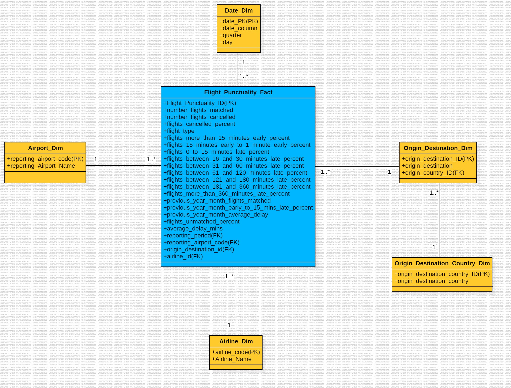

## Overview

This project focuses on building a data warehouse for analyzing flight punctuality data. It involves schema design, data population, and creating actionable visualizations using Tableau to extract insights. The aim is to showcase the benefits of data warehousing and advanced analytics in the airline industry.

## Project Goals

1. **Create a centralized data warehouse** for flight punctuality data to facilitate analytics.
2. **Implement a star schema** to enable efficient querying and reporting.
3. **Populate tables with data** processed using Python and Microsoft Excel.
4. **Generate visualizations** in Tableau to extract insights into flight punctuality, delays, and operational efficiency.


## Schema Design

A **star schema** was used with the following entities:
- **Fact Table**: `FLIGHT_PUNCTUALITY_FACT`
- **Dimension Tables**:
  - `AIRPORT_DIM`
  - `AIRLINE_DIM`
  - `DATE_DIM`
  - `ORIGIN_DESTINATION_DIM`
  - `ORIGIN_DESTINATION_COUNTRY_DIM`  
- **Final Schema Design**:  



## Table Definitions

### Example: `FLIGHT_PUNCTUALITY_FACT`
```sql
CREATE TABLE FLIGHT_PUNCTUALITY_FACT (
    FLIGHT_PUNCTUALITY_ID NUMBER PRIMARY KEY,
    NUMBER_FLIGHTS_MATCHED NUMBER,
    FLIGHTS_CANCELLED_PERCENT NUMBER,
    FLIGHT_TYPE VARCHAR2(100),
    ...
    AVERAGE_DELAY_MINS NUMBER,
    REPORTING_AIRPORT_CODE VARCHAR2(3),
    ORIGIN_DESTINATION_ID NUMBER,
    ARLINE_CODE VARCHAR2(5),
    FOREIGN KEY (REPORTING_AIRPORT_CODE) REFERENCES AIRPORT_DIM(REPORTING_AIRPORT_CODE),
    ...
);
```


## Data Processing and Population

1. **Combining Files**: 
   - Used Python's Pandas library to merge monthly CSV files into one dataset.
   - Handled encoding issues and missing columns.

2. **Transformations**:
   - Converted columns into appropriate formats (e.g., percentages, date).
   - Added new columns such as `reporting_airport_code` and `airline_code`.

3. **Database Loading**:
   - Populated tables using Oracle APEX Object Browser by mapping processed CSVs.


## Visualizations

### Created using Tableau:
1. **Punctuality of Top UK Airlines**:
   - Highlights airlines' early or delayed performance.  
    
   
2. **Flights Delay Pattern**:
    - Classifies delays into short and long categories.  
    
   
3. **Average Delay Trends**:
   - Tracks delay trends across reporting periods.  
   
4. **Flight Cancellations**:
   - Analyzes airports with the highest cancellations.  
   
5. **Flight Activity Insights**:
   - Identifies top airports based on matched flights.  
    


## Key Insights

1. **On-Time Performance**:
   - Jet2.com leads in punctuality with 64.1% early/on-time flights.
2. **Delay Trends**:
   - Summer months experience the highest delays.
3. **Top Airports**:
   - Heathrow, Gatwick, and Manchester dominate flight activity and cancellations.


## How to Run

1. **Database Setup**:
   - Load data using processed CSVs.

2. **Visualization**:
   - Import the Tableau workbook (`.twb`) and connect it to the database.

